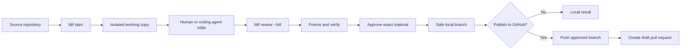

# FutureDiff

[](https://github.com/SHOnnay/futurediff/actions/workflows/ci.yml)
[](https://github.com/SHOnnay/futurediff/actions/workflows/public-alpha-release.yml)
[](LICENSE)
[](docs/LIMITATIONS.md)
[](docs/FDIF_INSTALLATION.md)

**Review AI-assisted code changes before they reach GitHub.**

FutureDiff is a local-first approval checkpoint for AI-assisted development. It gives a human or coding agent an isolated Git working copy, shows the exact change, runs verification, binds approval to the reviewed version, and publishes only that approved result as a safe branch.

GitHub publication is optional. FutureDiff can also push the approved branch and open a **draft pull request** without modifying the branch you were originally working on.

> **Status:** Public alpha. Designed for one user on one machine, with Linux and macOS as the supported runtime targets. Use the latest GitHub prerelease for packaged binaries; the default branch may contain unreleased stabilization work. See [Current limitations](#current-limitations).

---

## Why FutureDiff?

AI coding tools are fast, but the normal workflow often combines several different actions:

```text
edit code → commit → push → open pull request
```

That can make it difficult to answer a basic question:

> Is the code being published exactly the code I reviewed and approved?

FutureDiff separates editing from publication:

```text
isolated edit
→ exact review
→ freeze the reviewed version
→ verify
→ approve that exact version
→ create a safe local branch
→ optionally open a draft GitHub PR
```

Approval is tied to the reviewed transaction material. A later modification cannot silently reuse an earlier approval.

---

## Core workflow



The source branch remains unchanged throughout this flow.

---

## Quick start

### Requirements

- Go 1.23 or later
- Git
- a C toolchain
- SQLite development headers
- Linux or macOS

### Build the public commands

```bash
git clone https://github.com/SHOnnay/futurediff.git
cd futurediff

make check
make build-public
```

Add the local binaries to your shell for the current session:

```bash
export PATH="$PWD/bin:$PATH"
```

See the newcomer starting screen, check the environment, and run the disposable demo:

```bash
fdif
fdif doctor
fdif demo --yes
```

Bare `fdif` is safe in both interactive and non-interactive terminals. The numbered interactive menu is available with `fdif menu`.

The demo does not require GitHub credentials and does not modify one of your existing repositories.

For a shorter walkthrough, see [docs/QUICKSTART.md](docs/QUICKSTART.md).

### Keep local paths together

FutureDiff uses one local home for its current-change selection, daemon socket, runtime files, and safe workspaces:

```text
~/.futurediff
```

For an isolated environment, set one alternative home:

```bash
FDIF_HOME=/tmp/futurediff-test fdif config --explain
FDIF_HOME=/tmp/futurediff-test fdif demo --yes
```

Normal macOS aliases such as `/tmp` are canonicalized before use. Arbitrary user-controlled symlink traversal is still rejected. The advanced `--state` option changes only the current-selection file; use `--home` or `FDIF_HOME` to relocate daemon data and workspaces together.

---

## Use FutureDiff on a repository

### 1. Start an isolated change

Run FutureDiff from the repository you want to change:

```bash
cd /path/to/your/repository
fdif start
```

`fdif new` is an alias:

```bash
fdif new
```

FutureDiff prints the path of a safe working copy. Open that directory in your editor, terminal, or coding agent.

FutureDiff Alpha does not launch or supervise the coding agent. Start the agent yourself inside the displayed working-copy path.

Useful commands:

```bash
fdif status
fdif workspace
fdif shell
```

### 2. Make the change

Work only inside the safe working copy.

You can use:

- a normal editor;
- a terminal;
- an AI coding CLI;
- an IDE agent;
- a human developer.

Cooperative mode relies on the user or agent actually working inside the isolated copy.

### 3. Review the exact patch

```bash
fdif review
fdif review --full
```

The full review shows the Git patch that will become part of the approval process.

### 4. Verify, approve, and publish locally

```bash
fdif finish
```

FutureDiff guides the transaction through:

```text
review → freeze → verify → approve → publish
```

A successful local result is a branch similar to:

```text
futurediff/tx_77ad62755ed5618a2cc4e9a7
```

Your current source branch is not rewritten or silently merged.

### 5. Optionally create a draft GitHub PR

Choose GitHub publication on the first `finish` attempt:

```bash
fdif finish --github
```

FutureDiff displays the destination repository, base branch, safe head branch, and pull-request details before publication.

The approved result is then:

1. materialized as a safe local branch;
2. pushed as a create-only GitHub branch;
3. opened as a draft pull request;
4. recorded through provider receipts.

GitHub configuration is intentionally explicit. Follow [docs/FDIF_GITHUB_PUBLICATION.md](docs/FDIF_GITHUB_PUBLICATION.md) and never paste a token into documentation, command arguments, logs, or chat.

---

## What FutureDiff protects

FutureDiff provides:

- **isolated edits** — each change receives a separate Git working copy;
- **exact review** — inspect the files and lines that changed;
- **source pinning** — the transaction remembers the source branch and commit;
- **verification before approval** — run configured checks against frozen material;
- **digest-bound approval** — approval refers to the exact reviewed transaction;
- **safe local publication** — create `futurediff/<transaction-id>`;
- **optional draft PR publication** — push only the approved commit;
- **explicit external effects** — provider actions are prepared and recorded;
- **durable receipts** — publication outcomes can be inspected and reconciled;
- **fail-closed behavior** — stale state, ambiguous outcomes, damaged effects, or missing identity stop publication.

FutureDiff does **not** automatically merge a change into your active branch.

---

## Everyday commands

| Command | Purpose |
|---|---|
| `fdif` | Show the starting screen and next commands |
| `fdif menu` | Open the interactive numbered menu |
| `fdif start` | Start an isolated change |
| `fdif new` | Alias for `fdif start` |
| `fdif status` | Show the active transaction and state |
| `fdif workspace` | Print the safe working-copy path |
| `fdif shell` | Open a shell in the safe working copy |
| `fdif review` | Show a concise change summary |
| `fdif review --full` | Show the complete Git patch |
| `fdif finish` | Verify, approve, and publish locally |
| `fdif finish --github` | Also push and open a draft GitHub PR |
| `fdif abort` | Abort the active change |
| `fdif discard` | Alias for `fdif abort` |
| `fdif config --explain` | Show effective paths and configuration sources |
| `fdif doctor` | Check dependencies, paths, and daemon health |
| `fdif demo --yes` | Run the disposable local demo |
| `fdif completion <shell>` | Generate shell completion |

For all options, run:

```bash
fdif --help
fdif <command> --help
```

The exact low-level interface remains available through `futurediff`.

---

## Public components

FutureDiff ships three public executables:

```text
fdif          Guided, human-facing workflow
futurediff    Exact low-level CLI and automation client
futurediffd   Local transaction, verification, and publication daemon
```

A simplified relationship is:

```text
┌──────────────┐
│     fdif     │  guided workflow
└──────┬───────┘
       │
┌──────▼───────┐
│  futurediff  │  exact local API client
└──────┬───────┘
       │ local authenticated IPC
┌──────▼───────┐
│ futurediffd  │  transaction state and publication
└──────────────┘
```

The repository also contains internal assurance, recovery, research, and operator commands. They are not part of the minimal public-alpha distribution.

---

## Transaction lifecycle

A normal transaction progresses through states similar to:

```text
created
→ editing
→ sealed
→ verified
→ ready
→ approved
→ published
```

### Isolation

FutureDiff creates a separate Git working copy and records the original source branch and commit.

### Freeze and verification

The patch is frozen before approval. Verification runs against the transaction material that is about to be approved.

### Approval

Approval is bound to the exact transaction digest rather than to a general intention such as “publish whatever the agent currently has.”

### Local publication

The approved commit is materialized under:

```text
refs/heads/futurediff/<transaction-id>
```

### Provider publication

GitHub branch publication and draft-PR creation are explicit provider effects. Their results are stored as durable receipts. When an external outcome is uncertain, FutureDiff stops and preserves state for reconciliation rather than assuming success.

---

## Security model

FutureDiff Alpha is local-first and same-machine only.

### Local identity

- `futurediffd` communicates over local IPC;
- Linux uses kernel peer credentials;
- macOS uses native peer identity on the local Unix-domain socket;
- peer-authentication failure is fail-closed;
- the daemon and its socket must not be exposed directly over a network.

### Credentials

Provider credentials are optional and are not required for local publication.

When GitHub publication is enabled:

- keep tokens out of the repository;
- do not pass tokens as visible command-line arguments;
- use a restricted configuration file;
- restrict that file to the current user;
- use least-privilege repository access;
- allow only the required provider adapters, operations, and destinations.

### Cooperative mode is not a sandbox

The public-alpha default creates an isolated working copy, but it does not force an arbitrary process to remain inside that copy. Rootless OCI enforcement exists as experimental engineering work and is not a public-alpha guarantee.

### Local path safety

`fdif`, its daemon launcher, socket, current-selection file, runtime files, and safe workspaces share one resolved FutureDiff home. Known operating-system aliases needed for normal platform behavior are canonicalized, while arbitrary symlinked parents, a symlink home, and a symlink current-selection file remain rejected. Inspect the exact effective locations with:

```bash
fdif config --explain
```

Read [SECURITY.md](SECURITY.md) before using FutureDiff with sensitive repositories.

---

## Installation

### Build from source

```bash
git clone https://github.com/SHOnnay/futurediff.git
cd futurediff

make check
make build-public
```

The public binaries are written to:

```text
bin/fdif
bin/futurediff
bin/futurediffd
```

### Verified release archives

Tagged public-alpha releases are designed for:

- Linux AMD64
- Linux ARM64
- macOS ARM64
- macOS Intel

Each archive contains:

```text
LICENSE
README.md
VERSION
bin/fdif
bin/futurediff
bin/futurediffd
completions/_fdif
completions/fdif.bash
completions/fdif.fish
completions/fdif.ps1
```

Archives include SHA-256 sidecars. Verify the checksum before extraction or installation.

For complete release and installer instructions, see [docs/FDIF_INSTALLATION.md](docs/FDIF_INSTALLATION.md).

### Build and verify a native package

```bash
make public-package
make verify-public-package
```

---

## Shell completion

Generate completion for your shell:

```bash
fdif completion bash
fdif completion zsh
fdif completion fish
fdif completion powershell
```

Installation locations and examples are documented in [docs/FDIF_INSTALLATION.md](docs/FDIF_INSTALLATION.md).

---

## Supported scope

| Capability | Public-alpha status |
|---|---|
| Local Git repositories | Supported |
| Safe isolated working copy | Supported |
| Human-readable diff review | Supported |
| Local verification and approval | Supported |
| Safe local branch publication | Supported |
| Draft GitHub pull request | Supported, optional |
| Linux runtime | Supported |
| macOS runtime | Supported |
| Windows runtime | Not claimed |
| Automatic agent launch | Not supported |
| Hosted or network daemon | Not supported |
| Multi-user or multi-tenant service | Not supported |
| Automatic merge into source branch | Not supported |
| Rootless OCI enforcement | Experimental |
| Slack effects | Experimental |
| Independent security audit | Not completed |

---

## Current limitations

FutureDiff is an early alpha, not a hosted production service.

Current boundaries include:

- one user on one machine;
- local repositories and local IPC;
- Linux and macOS runtime targets;
- externally launched editors and coding agents;
- cooperative isolation by default;
- GitHub as the primary external code-review provider;
- no secure Windows runtime claim;
- no automatic merge into the active source branch;
- no formal uptime, SLO, retention, RBAC, quota, or disaster-recovery commitment;
- no independent security-certification claim;
- no production-complete claim.

The full boundary is documented in [docs/LIMITATIONS.md](docs/LIMITATIONS.md).

---

## Development

Run the main repository checks:

```bash
make check
make build
```

Run only the public-alpha contract tests:

```bash
make public-alpha-test
```

Build only the three public executables:

```bash
make build-public
```

Build and inspect the native release package:

```bash
make public-package
make verify-public-package
tar -tzf dist/public/*.tar.gz
```

Validate repository manifests:

```bash
./scripts/validate-overlay.sh
shasum -a 256 -c MANIFEST.sha256
```

On Linux, use `sha256sum -c MANIFEST.sha256` when appropriate.

---

## Documentation

### Start here

- [Quick start](docs/QUICKSTART.md)
- [Guided CLI](docs/FDIF_GUIDED_CLI.md)
- [Command reference](docs/FDIF_COMMAND_REFERENCE.md)
- [GitHub publication](docs/FDIF_GITHUB_PUBLICATION.md)
- [Installation](docs/FDIF_INSTALLATION.md)
- [Limitations](docs/LIMITATIONS.md)
- [Security policy](SECURITY.md)
- [Roadmap](ROADMAP.md)
- [Unified home and path decision](docs/adr/0003-fdif-home-and-path-canonicalization.md)

### Deeper technical material

- [Architecture](ARCHITECTURE.md)
- [Threat model](docs/THREAT_MODEL.md)
- protocol, recovery, evidence, provider, and assurance documents under `docs/`

Internal task identifiers, protocol versions, schema versions, and historical release-candidate numbers do not define the public product version.

---

## Project principles

1. **Isolation before action**
   Agent changes should not mutate the active source branch.

2. **Review exact material**
   Approval must refer to a concrete patch and resulting commit.

3. **Fail closed**
   Missing identity, stale source state, damaged effects, or ambiguous recovery must stop publication.

4. **Local value without providers**
   A safe local branch is a complete and useful result.

5. **Evidence over claims**
   Public guarantees should be backed by repeatable tests and real demonstrations.

---

## Contributing

FutureDiff is stabilizing its public-alpha interface. Contributions are especially useful when they improve:

- the core local transaction path;
- human-readable review;
- verification and approval safety;
- provider recovery and reconciliation;
- Linux and macOS authentication;
- installation and packaging;
- documentation;
- tests for security-critical behavior.

Before opening a pull request:

```bash
make check
make build
```

Keep changes focused, include tests, and avoid expanding public claims without matching evidence.

---

## Roadmap

Near-term work includes:

- stabilizing first-run and configuration UX across Linux and macOS;
- improving structured logs and stable error reporting;
- strengthening provider recovery UX;
- increasing core-path test coverage;
- adding package-manager distribution;
- obtaining an independent security review before any 1.0 claim.

See [ROADMAP.md](ROADMAP.md) for the complete roadmap and separation between public, experimental, and deferred work.

---

## License

FutureDiff is available under the [MIT License](LICENSE).
